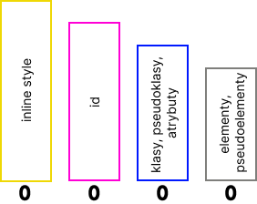

# CSS - pytania i odpowiedzi z sesji tech-check

## 1. Wyjaśnij różnicę pomiędzy em i rem

Zarówno `em`, jak i `rem` są jednostkami stosowanymi w **responsywnym** projektowaniu (podobnie jak `%` lub `vh`). Obydwie opierają się na wartości `font-size`. Weźmy pod uwagę prostą strukturę HTML:

```
<html lang="en">
    <!-- ... -->
    <body>
        <header>
            <div>Hello, World!</div>
            <span>Hello, Span!</span>
        </header>
    </body>
</html>
```

W przypadku `em`, jednostka ta odnosi się do wartości `font-size` rodzica (w tym przypadku `headera`). Jeśli `font-size` `headera` wynosi `20px`, to `1em` będzie równoważne `20px`, a `1.5em` będzie równoważne `30px`.
Jednak ważne jest zrozumienie, że jednostka `em` odnosi się do `font-size` rodzica tylko w przypadku właściwości `font-size`. W przypadku innych właściwości, takich jak `margin`,` padding`, `width`, `height` itp., jednostka `em` będzie się odnosić do `font-size` tego konkretnego elementu, w którym jest używana.

```
 .header {
      font-size: 16px;
}

.header div {
  font-size: 1.5em; /* Rozmiar czcionki 1.5 razy większy niż rozmiar czcionki header */
  /* Wartość w pikselach: 24px (16px * 1.5) */
  width: 10em; /* Szerokość elementu 10 razy większa niż rozmiar czcionki w tym elemencie */
  /* Wartość w pikselach: 240px (24px * 10) */
}
```

W przypadku `rem`, jednostka ta odnosi się do wartości `font-size` elementu HTML (`root`), który domyślnie wynosi `16px`. Dlatego, jeśli `font-size` elementu `<span>` wynosi `2rem`, to będzie równoważne `32px`:

```
header {
    font-size: 20px;
}

header span {
    font-size: 2rem;  /* 32px */
}
```

## 2. Wytłumacz model pudełkowy

W CSS każdy element HTML można przedstawić jako model pudełkowy (`box model`). Z wykorzystaniem modelu pudełkowego, możemy sterować wyglądem i układem strony.

Na model pudełkowy składa się zawartość / treść, margines wewnętrzny, obramowanie oraz margines zewnętrzny. Poniższa ilustracja dokładnie obrazuje, co się składa na `Box-Model`.


Poniżej krótkie omówienie każdego elementu:

- **właściwa (content)** - jest to zawartość bloku, w której może pojawić się tekst, obraz lub inne elementy HTML
- **margines wewnętrzny (padding)** - definiuje przestrzeń między zawartością a obramowaniem
- **obramowanie (border)** - jest to zawartość bloku, w której może pojawić się tekst, obraz lub inne elementy HTML
- **margines zewnętrzny (padding)** - definiuje wolną przestrzeń za obramowaniem

Więcej na ten temat znajdziesz tutaj: [MDN:BoxModel](https://developer.mozilla.org/en-US/docs/Learn/CSS/Building_blocks/The_box_model)

## 3. Wytłumacz różnicę pomiędzy: inline, block, inline-block

**Elementy inline** (`display: inline`):

- Elementy inline nie rozpoczynają się od nowego wiersza i zajmują tyle miejsca, ile potrzebują, bez tworzenia nowego bloku.
- Nie można ustawić szerokości i wysokości elementu inline.
- Przykłady: `<span>`, `<a>`, `<strong>`, `<em>`.

**Block** (`display: block`):

- Elementy block zaczynają się od nowego wiersza i zajmują całą dostępną szerokość, tworząc nowy blok.
- Można ustawić szerokość i wysokość elementu block.
- Przykłady: `<div>`, `<p>`, `<h1>`.

**Inline-block** (`display: inline-block`):

- Elementy `inline-block` łączą cechy elementów `inline` i `block`. Zachowują się jak elementy `inline`, ponieważ nie zaczynają - nowego wiersza, ale można ustawić im szerokość i wysokość.
- Przykłady: ``, `<button>`.

## 4. Wyjaśnij zachowanie margin-collapse we flexie

Zjawisko margin collapse występuje, gdy marginesy dwóch sąsiednich elementów blokowych nakładają się na siebie, a wynikowy margines jest równy większemu z dwóch marginesów.

```
<div>
    <div style="margin-bottom: 20px;">Element 1</div>
    <div style="margin-top: 30px;">Element 2</div>
</div>
```

W wyniku margin collapse odstęp pomiędzy Elementem 1 a Elementem 2 wyniesie `30px`, ponieważ `margin-bottom` Elementu 1 i `margin-top` Elementu 2 zostaną połączone.

**Flexbox i margin collapse**

Zjawisko margin collapsing nie zajdzie w przypadku gdy kontenerem jest flexbox. W przykładzie poniżej, odstęp między elementami zsumuje się i wyniesie `50px`.

```
<div style="display: flex; flex-direction: column">
    <div style="margin-bottom: 20px;">Element 1</div>
    <div style="margin-top: 30px;">Element 2</div>
</div>
```

## 5. Wyjaśnij czym jest metodologia BEM

BEM (Block Element Modifier) to konwencja nazewnictwa klas, która pomaga zorganizować kod CSS i HTML w bardziej czytelny i zrozumiały sposób. BEM skupia się na trzech podstawowych elementach: Blok, Element i Modyfikator.

**Block:**

- To główny kontener, który zawiera elementy i może istnieć samodzielnie.
- Nazwa bloku jest jednoznaczna i opisuje funkcję tego bloku.

`<div class="button">Przycisk</div>`

**Element**:

- To składnik bloku, który nie ma sensu istnieć samodzielnie. Jest związany z blokiem.
- Nazwa elementu jest oddzielona dwoma podwójnymi podkreśleniami od nazwy bloku.

```
<div class="button">
  <span class="button__text">Tekst przycisku</span>
</div>
```

**Modifier:**

- To flaga lub klucz, która opisuje zmianę wyglądu lub zachowania bloku lub elementu.
- Modyfikatory są dodawane do bloków lub elementów i zmieniają ich wygląd lub zachowanie. Zazwyczaj są rozdzielone dwoma myślnikami (`--`).

```
<div class="button button--large">
  <span class="button__text button__text--bold">Duży przycisk</span>
</div>
```

## 6. Jaka jest różnica pomiędzy position fixed, a sticky?

**Fixed** (`position: fixed`) - umożliwia umieszczenie elementu w dokładnie określonym miejscu na stronie, niezależnie od przewijania strony. Element z pozycją `fixed` pozostaje "przylepiony" do widocznej przestrzeni na ekranie, nie zmieniając swojej pozycji w zależności od przewinięcia strony.

**Sticky** (`position: sticky`) - to połączenie `fixed` i `relative`. Element z pozycją `sticky` zachowuje się jak element relative, dopóki nie osiągnie określonej pozycji podczas przewijania, a następnie staje się "przylepiony" i zachowuje się jak `fixed`.

Link do wizualizacji na MDN: [MDN-link](https://developer.mozilla.org/en-US/docs/Web/CSS/position#try_it)

## 7. Wytłumacz działanie właściwości position: absolute

Ustawienie position: `absolute` na elemencie sprawia, że wypada on z normalnego przepływu dokumentu HTML. Oznacza to, że przestaje on mieć wpływ na układ innych elementów, a równocześnie sam jest ignorowany przez pozostałe elementy.

Kilka ważnych rzeczy do zapamiętania:

- Elementowi z `position: absolute` możemy nadać wartości dla właściwości top, left, right i bottom.
- Jeśli nie ustawimy żadnej z tych wartości, element z `position: absolute` zostanie umieszczony w dokładnie tym samym miejscu, co gdyby miał `position: static`.
- Wszystkie inne elementy układają się tak, jakby element z pozycją absolute w ogóle nie istniał, ignorując jego zajmowaną przestrzeń.
- Pozycjonowanie elementu z pozycją absolute odbywa się względem początku dokumentu HTML (`<html>`), czyli górnej krawędzi okna przeglądarki (przy założeniu, że wszyscy przodkowie danego elementu mają pozycję domyślną `static`).
- Jeżeli któryś z przodków ma ustawioną pozycję na relative, element z position: absolute będzie się pozycjonował względem tego przodka.

## 8. Wyjaśnij pojęcie: waga selektorów CSS

Waga selektorów wpływa na to, który z nich zostanie wzięty pod uwagę i jakie style zostaną zaaplikowane do elementu HTML.

1. Najwyższy priorytet mają style zapisane inline, czyli bezpośrednio w tagu HTML, przy użyciu atrybutu `style="..."`. Nadpisać je mogą wyłącznie style oznaczone jako `!important`.
2. Następne w kolejności są style nadane za pomocą selektora `#id`
3. Po nich występują style nadane za pomocą klas (`.class`), pseudoklas (`:visited`) oraz atrybutów (`[data-test="example"]`)
4. Na samym końcu są style nadane za pomocą selektorów elementów (`div`, `p`) oraz pseudoelementów (`::before`)

**Najłatwiej zapamiętać te reguły w następujący sposób:**
Istnieją cztery kolumny. Utworzenie selektora sprawia, że do wybranej z nich (w zależności od selektora) dodajemy jeden punkt. Niższe kolumny, nigdy nie osiągną większej wagi, niż kolumny wyższe.

Prosta wizualizacja:



## 9. Wyjaśnij czym są pseudo elementy

Pseudo elementy pozwalają na utworzenie dodatkowych elementów, których pierwotnie nie ma w drzewie DOM. Dają także możliwość nadania im dowolnych styli CSS. Najczęściej są wykorzystywane w celu utworzenia elementów dekoracyjnych na stronie.

**Najczęściej używane pseudo elementy:**

- `::before` - pozwala na dodanie dodatkowego elementu przed zawartością tagu HTML
- `::after` - pozwala na dodanie dodatkowego elementu po zawartości tagu HTML
- `::selection` - pozwala na zmianę wyglądu zaznaczonych elementów strony
- `::placeholder` - zmienia wygląd placeholderów w inputach

## 10. Wytłumacz działanie następujących selektorów

`p + span` - plus to selektor rodzeństwa. Wyszukane zostaną wszystkie tagi `<span>`, których bezpośrednim rodzeństwem jest tag `<p>`

`h1[title]` - nawiasy kwadratowe oznaczają selektor atrybutu. Zostaną wyszukane wszystkie tagi `<h1>`, które posiadają atrybut `title`. Jego zawartość nie ma w tym przypadku znaczenia

`p > span` - nawias zamykający ostry, jest selektorem bezpośredniego dziecka. Szukamy zatem tagów `<span>`, które są bezpośrednimi dziećmi tagu `<p>`

`span:nth-child(2n + 5)` - pseudo klasa `:nth-child()` służy do wybierania elementów na podstawie ich kolejności występowania w tagu nadrzędnym. Innymi słowy - pod uwagę brane są ich indexy. W tym przypadku wybranie zostany co drugi tag `<span>`, zaczynając od piątego dziecka

## 11. Jakie style ma podany tag? Dlaczego?

**Przykład 1 - jaki jest kolor tagu h1?**

**HTML**

```
<div>
    <p>some paragraph</p>
    <h1>Hello world!</h1>
</div>
```

**CSS**

```
h1[title="Hello world!"] {
    color: red;
}

div > p > h1 {
    color: blue;
}
```

**Rozwiązanie**: kolor tagu `<h1>` nie zmienia się, ponieważ żaden z selektorów do niego nie pasuje. Oznacza to, że pozostaje on taki, jaki był na początku (jeżeli nie ma innych styli, to jest czarny).

---

**Przykład 2 - jakie tło ma element nav?**

**HTML**

```
 <body>
    <main class="container flexbox">
      <nav class="navigation">
        <!-- content -->
      </nav>
    </main>
  </body>
```

**CSS**

```
.container {
  width: 100%;
  height: 500px;
  background-color: blue;
}

.container.flexbox nav {
  background-color: green;
}

.navigation {
  width: 100%;
  height: 200px;
  background-color: red;
}
```

**Rozwiązanie**: kolor tła tagu `<nav>` to zielony. Dzieje się tak, ponieważ selektor `.container.flexbox nav` używa dwóch klas, więc jego waga jest wyższa niż selektora `.navigation`, który ma tylko jedną klasę.

## 12. Wyjaśnij działanie jednostek vh i vw

Jednostki `vh` (viewport height) i `vw` (viewport width), jak sama nazwa wskazuje, zachowują się relatywnie względem wymiarów ekranu (czyli inaczej viewportu). Oznacza to, że wraz ze zmianą wymiarów okna, zmienia się także wartość tych jednostek.

**vh**

- odpowiada za procentowy rozmiar względem wysokości ekranu (`1vh == 1%` wysokości ekranu)
- zastosowanie np: height: `50vh` oznacza, że dany element zawsze będzie miał `50%` wysokości ekranu, niezależnie od jego wymiarów

**vw**

- odpowiada za procentowy rozmiar względem szerokości ekranu (`1vw == 1%` szerokości ekranu)
- zastosowanie np: width: `50vw` oznacza, że dany element zawsze będzie miał `50%` szerokości ekranu, niezależnie od jego wymiarów

Wykorzystywane są najczęściej do tworzenia responsywnych layoutów.

## 13. Jakie wymiary ma podany element? Dlaczego?

**Przykład 1 - jakie wymiary ma element div?**

**HTML**

```
<body>
  <div></div>
</body>
```

**CSS**

```
div {
  width: 200px;
  height: 200px;
  padding: 20px;
  margin: 10px;
  border: 10px solid black;
}
```

**Rozwiązanie**: odpowiedź to: szerokość `260px`, wysokość `260px` (jest to kwadrat). Dzieje się tak, ponieważ właściwość `box-sizing` domyślnie przyjmuje wartość `content-box`. Oznacza to, że `padding` oraz `border` **powiększą element**.

---

**Przykład 2 - jakie wymiary ma element div?**

**HTML**

```
<body>
  <div></div>
</body>
```

**CSS**

```
div {
  box-sizing: border-box;
  width: 100px;
  padding: 20px;
  margin: 10px;
  border: 10px solid black;
}
```

**Rozwiązanie**: odpowiedź to: szerokość `100px`, wysokość `60px`. Dzieje się tak, ponieważ właściwość `box-sizing` ma wartość `border-box`. Oznacza to, że `padding` oraz `border` nie **powiększą element**, za to **zmniejszą przestrzeń dostępną “wewnątrz”**.
